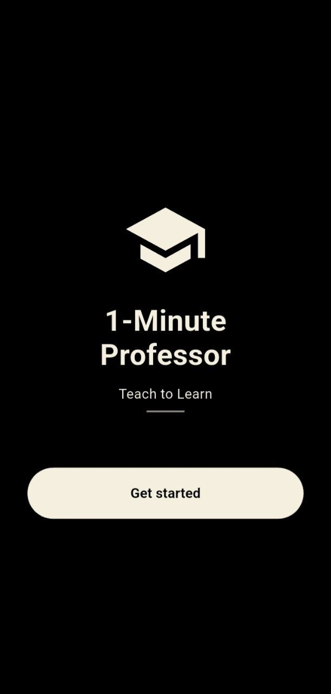
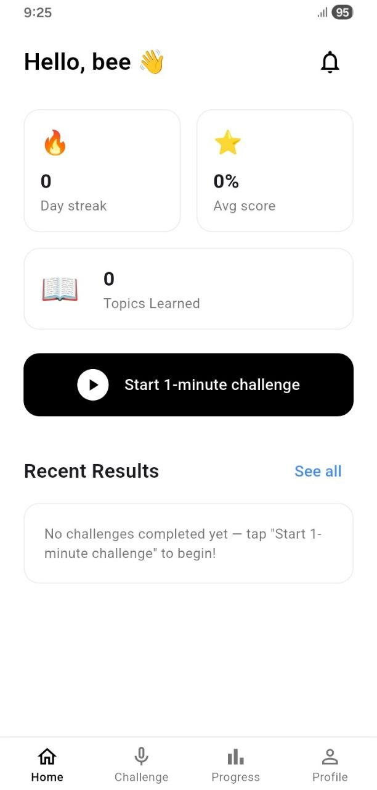
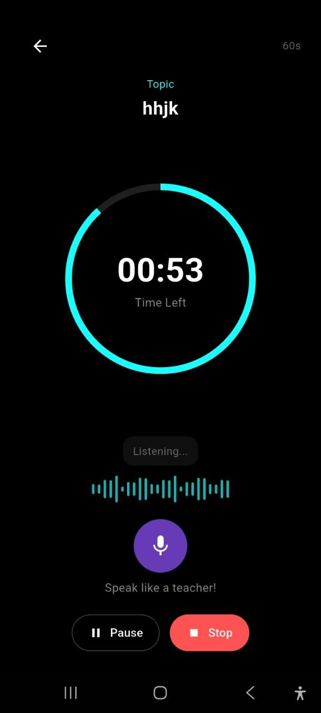
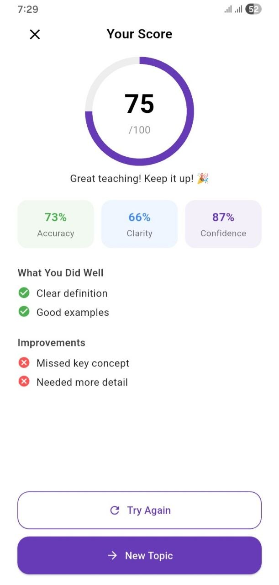
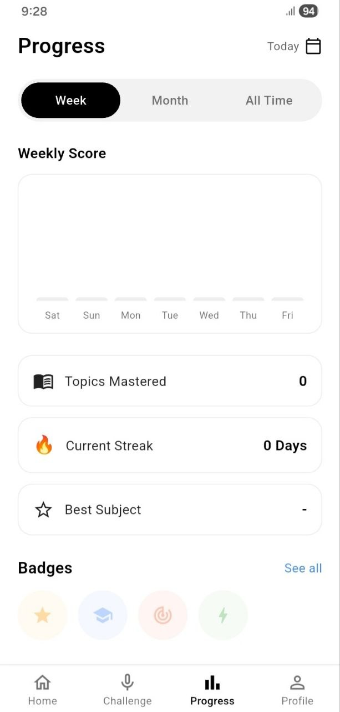
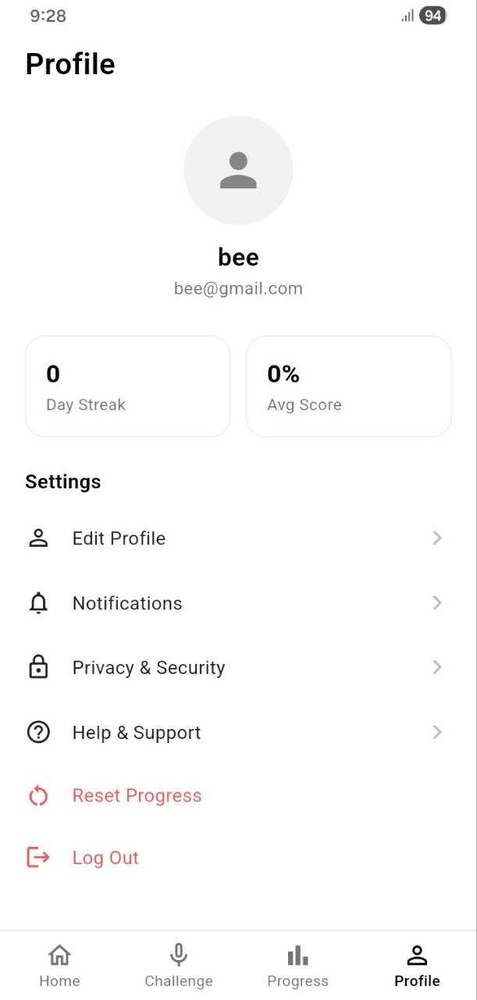

# 🎓 One Minute Professor

> Learn by teaching. Explain any topic in 60 seconds using the Feynman Learning Technique.

One Minute Professor is a Flutter-based learning application designed to improve understanding and memory through active recall and explanation. The app challenges users to explain concepts in their own words and provides a better way to learn by teaching.

---

## 📱 App Overview

Many students memorize information without deeply understanding it. One Minute Professor uses the **Feynman Technique**, where learners explain a concept simply as if they are teaching someone else.

The application gives users a topic, provides one minute to explain it, and helps them improve their learning process.

---
## 📸 Screenshots

### Splash Screen



The welcome screen displayed when the application starts.

### Home Screen



The main dashboard where users can start a new learning session and access app features.
### Topic Selection Screen


Allows users to select or generate a learning topic before starting the one-minute explanation challenge.

### Recording Screen



Users explain a topic using their voice and practice the Feynman learning technique.

### Feedback and Score Screen



Displays AI-generated feedback, explanation analysis, and performance scores.

### Progress Screen



Tracks learning history, performance trends, and improvement over time.

### Profile Screen



Allows users to view profile information and manage application settings.

## ✨ Features

### 🎯 Learning Challenge
- Generate random learning topics
- 60-second explanation challenge
- Practice explaining concepts clearly

### 🤖 AI-Powered Feedback
- Analyze user explanations
- Provide suggestions for improvement
- Help identify missing information

### 🎤 Voice Explanation
- Speech-to-text explanation support
- Hands-free learning experience

### 📚 Learning History
- Save previous explanations
- Review learning progress
- Track improvement over time

### ⚙️ User Settings
- Customize learning preferences
- Manage application options

---

## 🛠️ Technologies Used

| Technology | Purpose |
|---|---|
| Flutter | Cross-platform mobile development |
| Dart | Programming language |
|Anthropic Claude API | AI explanation analysis |
| Speech To Text | Voice recognition |
| Shared Preferences | Local data storage |

---

## 📂 Project Structure

lib/
│
├── main.dart
├── models/
├── routes/
├── screens/
├── services/
├── widgets/
└── utils/

---

## 🚀 Getting Started

### Prerequisites

Make sure you have installed:

- Flutter SDK
- Android Studio / VS Code
- Android Emulator or Physical Device

Check Flutter installation:

```bash
flutter doctor
flutter pub get
flutter run
```
